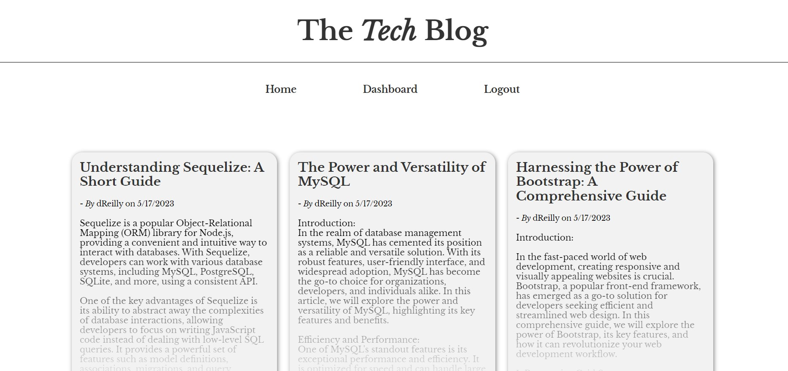
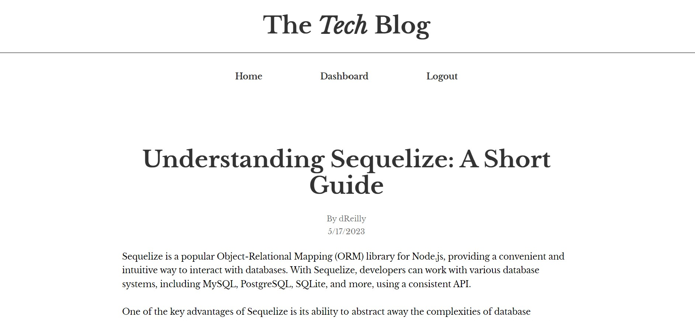
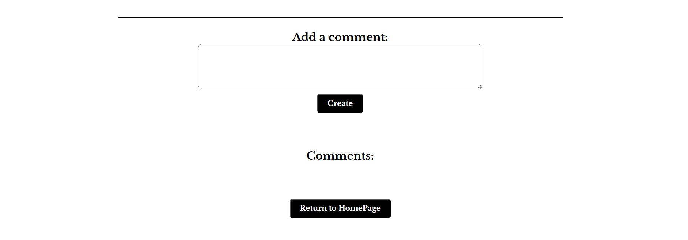
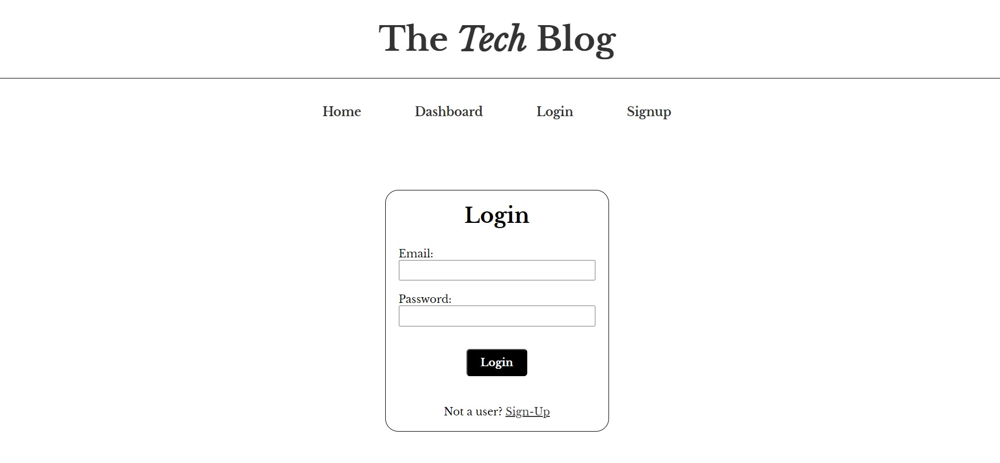
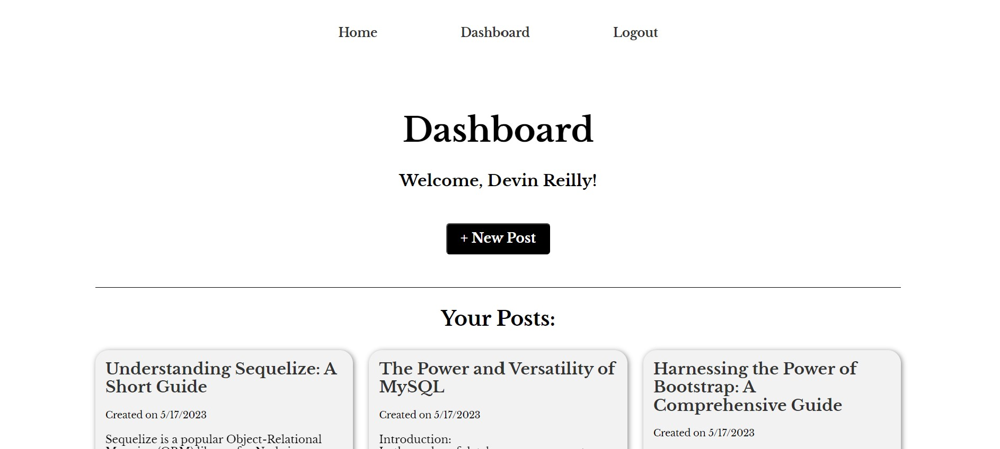

<header style="height: 100px; background: linear-gradient(to right, #000046, #1CB5E0);"><h1 style="font-size: 65px; text-align: center"><strong></strong>Tech Blog</h1></header>

 

 

> # [Description](#description)
A CMS-style blog site similar to a Wordpress site, where developers can publish their blog posts and comment on other developers’ posts as well.

<h2>Check out the deployed site: <a href="https://tech-blog-devin.herokuapp.com/">Tech Blog!</a></h2>
 
 

---

Table of Contents
 

- [Description](#description)
- [Getting Started](#getting-started)
  - [Project Status](#project-status)
  - [Installation](#installation)
  - [Useage](#useage)
  - [Demonstration](#demonstration)
  - [Contributing Guidelines](#contributing)
  - [Test Instructions](#test) 
  - [License](#license)
- [Credits](#credits)
  - [Contributors](#contributors)
  - [Acknowledgements](#acknowledgements)
- [Questions](#questions)

 
 

---

> # [Getting Started](#getting-started)

 

## [Project Status](#project-status)
    MVP - Minimal Viable Product

 

This web application has a working and deployed site. Checkout our <a href="https://tech-blog-devin.herokuapp.com/">Tech Blog!</a>

Or to get a better look at the code, please visit our GitHub repository: <a href="https://github.com/werthird/Tech-Blog-Model-14">Tech-Blog</a>

 

## [Installation](#installation)
No installation required. 

Checkout our website: <a href="https://tech-blog-devin.herokuapp.com/">Tech Blog</a>

 

## [Useage](#useage)
After accessing the deployed site, there are a multitude of things you are able to do.

  1. The home page offers the ability to browse the current blog posts
  2. When clicking on a blog post, the post is rendered on a full page with the ability to read the whole post, read the comments, and if logged in, add comments.
  3. The user is offered the ability to login or signup.
  4. When logged in, the user is able to view their dashboard, with a list or all blog post that they created.
  5. From the dashboard, the user is able to edit their own blogpost, or create a new blog post. 
  6. Finally, the user is able to logout of their current session, or the session will time out after a set amount of time.

 

## [Demonstration](#demonstration)

Homepage

 

Post

 

Comment

 

Login

 

Dashboard

 

## [Contributing Guidelines](#contributing)
No contributing guidelines. For any suggestions or comments, please see [Questions](#questions) section below.

 

## [Test Instructions](#test)
No testing instructions at this time.

 

## [License](#license)
Distributed under the MIT License. See LICENSE.txt for more information.

 
 

---

> # [Credits](#credits)

 

## [Contributors](#contributors)

Designed and built by Devin Reilly

 

## [Acknowledgements](#acknowledgements)
- [The Full-Stack Blog](https://coding-boot-camp.github.io/full-stack/github/professional-readme-guide) - README Template 
- UCF Instructor **John Dinsmore**, and TA's, **Kristofer Marshall** and **Rider Cogswell**
- Students of UCF Coding Boot Camp, in class, on Slack and on Discord
- Research articles from Google Search, ChatGPT, MDN Docs, W3Schools

 
 

---

> # [Questions](#questions)

Here is a link to our <a href="https://github.com/werthird">GitHub profile page!</a>

Or send us an <a href="mailto: werthird@aol.com?subject=Tech Blog Feedback">Email!</a>
